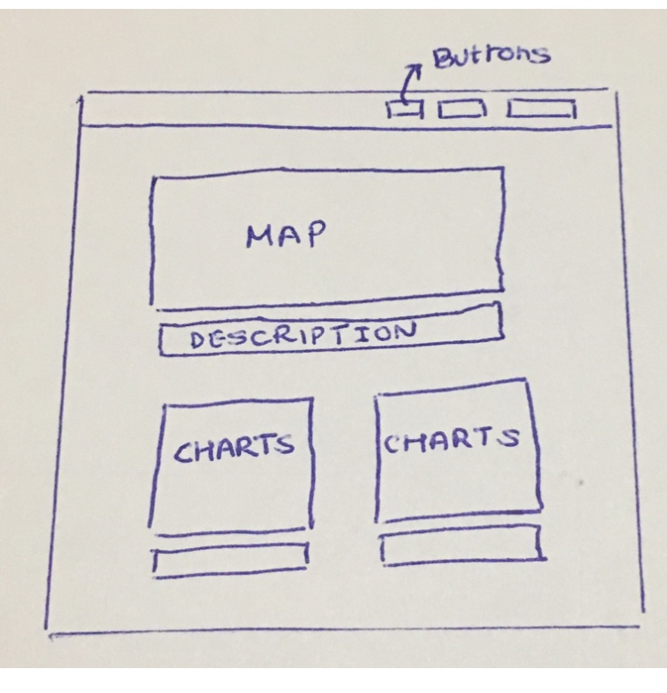
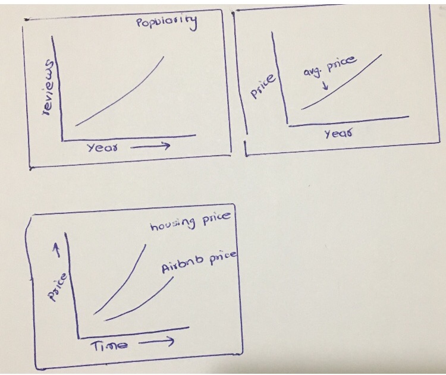

# [Project Title]
Creative Viz - Portland AirBNB relative to housing costs 

## Project Topic

AirBNB Portland dataset exploration
1) Is popularity of portland AirBNB increaseing with time, 2015 to 2019? (we are going to explore reviews count by year)
2) How is the average price of portland AirBNB changing over time?
3) Compare prices of AirBNB and houselisting prices over time.

## Rationale 

Housing costs in Portland can be a controversial subject, and one of the considerations of the demand for housing are short-term rentals like AirBNB and VRBO. The latter did not offer any data that we could find, but the former does. We intend to explore a by neighborhood view of the data and provide a year or year breakdown based on AirBNB reviews, listing prices and home listing prices in the Portland area.

## Data Sets

Zillow API calls
AirBNBs CSVs from Data World
Potentially Yelp API calls (Time permitting)
https://www.portlandmaps.com/metadata/index.cfm?&action=DisplayLayer&LayerID=54371

## Project Track & Stack

- Describe which category your final result will fit into. It's okay to be creative and diverge a bit, so let us know if that is the case.
- Creative d3 viz
- Use Libraries like leaflet to build multiple views of your data source
- ETL or Data processing on a Python server (Jupyter notebook) (must still have visualizations and interaction but they can be simpler than other projects) 

What stack components are you going for?
- ETL Script?
- PostgreSQL Database?
- Front-end compenents html/css/js (Required)
- Deploy on Github

## Sketches & Inspiration

_Describe the end product you're going for from a user perspective_

_Add image(s) showing your proposed final design. This could be a mockup of a dashboard, a quick sketch of the visualizations you will create, a ETL Diagram of your data, or somthing similar. Feel free to be creative_

_Add 3 or 4 screenshots of relevant, “inspiring” visualizations that frame your creative fodder_

[I'm an inline-style link](https://www.google.com)

[I'm an inline-style link](https://www.google.com)

## OPTIONAL Work load organization

We will divy up the components of the project based on how comfortable each member of the team is with it and consider strengths.